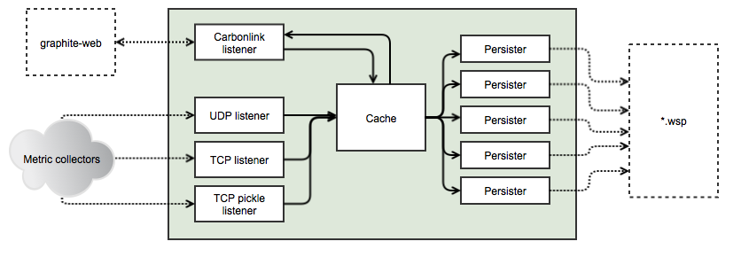

go-carbon
============

Golang implementation of Graphite/Carbon server with classic architecture: Agent -> Cache -> Persister




### Supported features
* Receive metrics from TCP and UDP ([plaintext protocol](http://graphite.readthedocs.org/en/latest/feeding-carbon.html#the-plaintext-protocol))
* Receive metrics with [Pickle protocol](http://graphite.readthedocs.org/en/latest/feeding-carbon.html#the-pickle-protocol) (TCP only)
* [storage-schemas.conf](http://graphite.readthedocs.org/en/latest/config-carbon.html#storage-schemas-conf)
* Carbonlink (requests to cache from graphite-web)
* Logging with rotation (reopen logfile on HUP)
* Many persister workers (with use many cpu cores)
* Run as daemon


### TODO
* [storage-aggregation.conf](http://graphite.readthedocs.org/en/latest/config-carbon.html#storage-aggregation-conf) support


## Installation
```
git clone https://github.com/lomik/go-carbon.git
cd go-carbon
git submodule init
git submodule update
make

sudo install -m 0755 go-carbon /usr/local/bin/go-carbon
sudo go-carbon --config-print-default > /usr/local/etc/carbon.conf
sudo vim /usr/local/etc/carbon.conf
sudo go-carbon --config /usr/local/etc/carbon.conf --daemon
```

## Configuration
```
$ go-carbon --help
Usage of go-carbon:
  -check-config=false: Check config and exit
  -config="": Filename of config
  -config-print-default=false: Print default config
  -daemon=false: Run in background
  -pidfile="": Pidfile path (only for daemon)
```

```
[common]
# Run as user. Works only in daemon mode
user = ""
# If logfile is empty use stderr
logfile = ""
# Prefix for store all carbon graphs. Supported macroses: {host}
graph-prefix = "carbon.agents.{host}."
# Increase for configuration with multi persisters
max-cpu = 1

[whisper]
data-dir = "/data/graphite/whisper/"
schemas-file = "/data/graphite/schemas"
# Workers count. Metrics sharded by "crc32(metricName) % workers"
workers = 1
enabled = true

[cache]
# Limit of in-memory stored points (not metrics)
max-size = 1000000
# Capacity of queue between receivers and cache
input-buffer = 51200

[udp]
listen = ":2003"
enabled = true

[tcp]
listen = ":2003"
enabled = true

[pickle]
listen = ":2004"
enabled = true

[carbonlink]
listen = "127.0.0.1:7002"
enabled = true
# Close inactive connections after "read-timeout"
read-timeout = "30s"
# Return empty result if cache not reply
query-timeout = "100ms"

[pprof]
listen = "localhost:7007"
enabled = false
```

