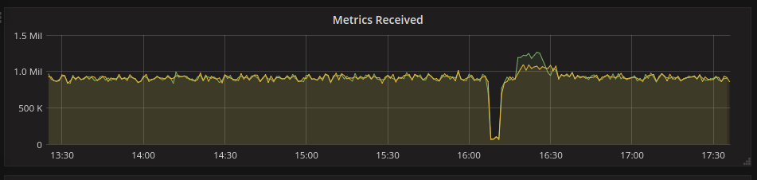

[](https://packagecloud.io/go-graphite/stable)
[](https://packagecloud.io/go-graphite/stable)

Table of Contents
=================

- [Table of Contents](#table-of-contents)
- [go-carbon ](#go-carbon-)
  - [Features](#features)
  - [Performance](#performance)
    - [Efficient metric namespace patterns for trie index](#efficient-metric-namespace-patterns-for-trie-index)
  - [Installation](#installation)
  - [Configuration](#configuration)
    - [OS tuning](#os-tuning)
  - [Reported stats](#reported-stats)
  - [Changelog](#changelog)


go-carbon [](https://travis-ci.org/go-graphite/go-carbon)
============

Golang implementation of Graphite/Carbon server with classic architecture: Agent -> Cache -> Persister


## Features
- Receive metrics from TCP and UDP ([plaintext protocol](http://graphite.readthedocs.org/en/latest/feeding-carbon.html#the-plaintext-protocol))
- Receive metrics with [Pickle protocol](http://graphite.readthedocs.org/en/latest/feeding-carbon.html#the-pickle-protocol) (TCP only)
- Receive metrics from HTTP
- Receive metrics from Apache Kafka
- [storage-schemas.conf](http://graphite.readthedocs.org/en/latest/config-carbon.html#storage-schemas-conf)
- [storage-aggregation.conf](http://graphite.readthedocs.org/en/latest/config-carbon.html#storage-aggregation-conf)
- Carbonlink (requests to cache from graphite-web)
- Carbonlink-like GRPC api
- Logging with rotation support (reopen log if it moves)
- Many persister workers (using many cpu cores)
- Run as daemon
- Optional dump/restore restart on `USR2` signal (config `dump` section): stop persister, start write new data to file, dump cache to file, stop all (and restore from files after next start)
- Reload some config options without restart (HUP signal):
  - `whisper` section of main config, `storage-schemas.conf` and `storage-aggregation.conf`
  - `graph-prefix`, `metric-interval`, `metric-endpoint`, `max-cpu` from `common` section
  - `dump` section

## Performance

Faster than default carbon. In all conditions :) How much faster depends on server hardware, storage-schemas, etc.

The result of replacing "carbon" to "go-carbon" on a server with a load up to 900 thousand metric per minute:


There were some efforts to find out maximum possible performance of go-carbon on a hardware (2xE5-2620v3, 128GB RAM, local SSDs).

The result of that effort (in points per second):



Stable performance was around 950k points per second with short-term peak performance of 1.2M points/sec.

### Efficient metric namespace patterns for trie index

Putting the most common namespaces at the beginning of the metric name could be beneficial for scaling. This doesn't affect the performance of trigram index. But when you decide to switch to trie index for serving higher number metrics in a single go-carbon instance, your query would be more efficient. At the same time, this naming pattern could lead to better metric namespace hierarchy.

For example: querying `sys.cpu.loadavg.app.host-0001` would be faster than querying `sys.app.host-0001.cpu.loadavg` using trie index. Especially when you have tens of thousands hosts (host-0001, ..., host-9999), they all share the same prefix of `sys.cpu.loadavg.app.host-` in trie index, and they are compared only once during query. So this patterns leads to better memory usage and query performance when using trie+nfa/dfa index.

More details could be found in this blog: [To glob 10M metrics: Trie * DFA = Tree² for Go-Carbon](https://www.xhu.buzz/to-glob-10m-metrics-using-trie-and-dfa/).

## Installation
Use binary packages from [releases page](https://github.com/lomik/go-carbon/releases) or build manually (requires golang 1.8+):
```
# build binary
git clone https://github.com/go-graphite/go-carbon.git
cd go-carbon
make
```

We are using <a href="https://packagecloud.io/"></a> to host our packages!

At this moment we are building deb and rpm packages for i386, amd64 and arm64 architectures. Installation guides are available on packagecloud (see the links below).

Stable versions: [Stable repo](https://packagecloud.io/go-graphite/stable/install)

Autobuilds (master, might be unstable): [Autobuild repo](https://packagecloud.io/go-graphite/autobuilds/install)

We're uploading Docker images to [ghcr.io](https://github.com/go-graphite/go-carbon/pkgs/container/go-carbon)

Also, you can download test packages from build artifacts: Go to list of [test runs](https://github.com/go-graphite/go-carbon/actions/workflows/tests.yml), click on PR name, and click on *"packages-^1"* under *"Artifact"* section.

## Configuration

```
$ go-carbon --help
Usage of go-carbon:
  -check-config=false: Check config and exit
  -config="": Filename of config
  -config-print-default=false: Print default config
  -daemon=false: Run in background
  -pidfile="": Pidfile path (only for daemon)
  -version=false: Print version
```

```ini
[common]
# Run as user. Works only in daemon mode
user = "carbon"
# Prefix for store all internal go-carbon graphs. Supported macroses: {host}
graph-prefix = "carbon.agents.{host}"
# Endpoint to store internal carbon metrics. Valid values: "" or "local", "tcp://host:port", "udp://host:port"
metric-endpoint = "local"
# Interval of storing internal metrics. Like CARBON_METRIC_INTERVAL
metric-interval = "1m0s"
# Increase for configuration with multi persister workers
max-cpu = 4

[whisper]
data-dir = "/var/lib/graphite/whisper"
# http://graphite.readthedocs.org/en/latest/config-carbon.html#storage-schemas-conf. Required
schemas-file = "/etc/go-carbon/storage-schemas.conf"
# http://graphite.readthedocs.org/en/latest/config-carbon.html#storage-aggregation-conf. Optional
aggregation-file = "/etc/go-carbon/storage-aggregation.conf"
# It's currently go-carbon only feature, not a standard graphite feature. Optional
# More details in doc/quotas.md
# quotas-file = "/etc/go-carbon/storage-quotas.conf"
# Worker threads count. Metrics sharded by "crc32(metricName) % workers"
workers = 8
# Limits the number of whisper update_many() calls per second. 0 - no limit
max-updates-per-second = 0
# Sparse file creation
sparse-create = false
# use flock on every file call (ensures consistency if there are concurrent read/writes to the same file)
flock = true
enabled = true
# Use hashed filenames for tagged metrics instead of human readable
# https://github.com/go-graphite/go-carbon/pull/225
hash-filenames = true
# specify to enable/disable compressed format (EXPERIMENTAL)
# See details and limitations in https://github.com/go-graphite/go-whisper#compressed-format
# IMPORTANT: Only one process/thread could write to compressed whisper files at a time, especially when you are
# rebalancing graphite clusters (with buckytools, for example), flock needs to be enabled both in go-carbon and your tooling.
compressed = false
# automatically delete empty whisper file caused by edge cases like server reboot
remove-empty-file = false

# Enable online whisper file config migration.
#
# online-migration-rate means metrics per second to migrate.
#
# To partially enable default migration for only some matched rules in
# storage-schemas.conf or storage-aggregation.conf, we can set
# online-migration-global-scope = "-" and enable the migration in the config
# files (more examples in deploy/storage-aggregation.conf and deploy/storage-schemas.conf).
#
# online-migration-global-scope can also be set any combination of the 3 rules
# (xff,aggregationMethod,schema) as a csv string
# like: "xff", "xff,aggregationMethod", "xff,schema",
# or "xff,aggregationMethod,schema".
#
# online-migration = false
# online-migration-rate = 5
# online-migration-global-scope = "-"

[cache]
# Limit of in-memory stored points (not metrics)
max-size = 1000000
# Capacity of queue between receivers and cache
# Strategy to persist metrics. Values: "max","sorted","noop"
#   "max" - write metrics with most unwritten datapoints first
#   "sorted" - sort by timestamp of first unwritten datapoint.
#   "noop" - pick metrics to write in unspecified order,
#            requires least CPU and improves cache responsiveness
write-strategy = "max"
# If > 0 use bloom filter to detect new metrics instead of cache (EXPERIMENTAL)
# works better for multi-million metrics installations
bloom-size = 0

[udp]
listen = ":2003"
enabled = true
# Optional internal queue between receiver and cache
buffer-size = 0

[tcp]
listen = ":2003"
enabled = true
# Optional internal queue between receiver and cache
buffer-size = 0

[pickle]
listen = ":2004"
# Limit message size for prevent memory overflow
max-message-size = 67108864
enabled = true
# Optional internal queue between receiver and cache
buffer-size = 0

# You can define unlimited count of additional receivers
# Common definition scheme:
# [receiver.<any receiver name>]
# protocol = "<any supported protocol>"
# <protocol specific options>
#
# All available protocols:
#
# [receiver.udp2]
# protocol = "udp"
# listen = ":2003"
# # Enable optional logging of incomplete messages (chunked by max UDP packet size)
# log-incomplete = false
#
# [receiver.tcp2]
# protocol = "tcp"
# listen = ":2003"
#
# [receiver.pickle2]
# protocol = "pickle"
# listen = ":2004"
# # Limit message size for prevent memory overflow
# max-message-size = 67108864
#
# [receiver.protobuf]
# protocol = "protobuf"
# # Same framing protocol as pickle, but message encoded in protobuf format
# # See https://github.com/go-graphite/go-carbon/blob/master/helper/carbonpb/carbon.proto
# listen = ":2005"
# # Limit message size for prevent memory overflow
# max-message-size = 67108864
#
# [receiver.http]
# protocol = "http"
# # This receiver receives data from POST requests body.
# # Data can be encoded in plain text format (default),
# # protobuf (with Content-Type: application/protobuf header) or
# # pickle (with Content-Type: application/python-pickle header).
# listen = ":2007"
# max-message-size = 67108864
#
# [receiver.kafka]
# protocol = "kafka
# # This receiver receives data from kafka
# # You can use Partitions and Topics to do sharding
# # State is saved in local file to avoid problems with multiple consumers
#
# # Encoding of messages
# # Available options: "plain" (default), "protobuf", "pickle"
# #   Please note that for "plain" you must pass metrics with leading "\n".
# #   e.x.
# #    echo "test.metric $(date +%s) $(date +%s)" | kafkacat -D $'\0' -z snappy -T -b localhost:9092 -t graphite
# parse-protocol = "protobuf"
# # Kafka connection parameters
# brokers = [ "host1:9092", "host2:9092" ]
# topic = "graphite"
# partition = 0
#
# # Specify how often receiver will try to connect to kafka in case of network problems
# reconnect-interval = "5m"
# # How often receiver will ask Kafka for new data (in case there was no messages available to read)
# fetch-interval = "200ms"
#
# # Path to saved kafka state. Used for restarts
# state-file = "/var/lib/graphite/kafka.state"
# # Initial offset, if there is no saved state. Can be relative time or "newest" or "oldest".
# # In case offset is unavailable (in future, etc) fallback is "oldest"
# initial-offset = "-30m"
#
# # Specify kafka feature level (default: 0.11.0.0).
# # Please note that some features (consuming lz4 compressed streams) requires kafka >0.11
# # You must specify version in full. E.x. '0.11.0.0' - ok, but '0.11' is not.
# # Supported version (as of 22 Jan 2018):
# #   0.8.2.0
# #   0.8.2.1
# #   0.8.2.2
# #   0.9.0.0
# #   0.9.0.1
# #   0.10.0.0
# #   0.10.0.1
# #   0.10.1.0
# #   0.10.2.0
# #   0.11.0.0
# #   1.0.0
# kafka-version = "0.11.0.0"
#
# [receiver.pubsub]
# # This receiver receives data from Google PubSub
# # - Authentication is managed through APPLICATION_DEFAULT_CREDENTIALS:
# #   - https://cloud.google.com/docs/authentication/production#providing_credentials_to_your_application
# # - Currently the subscription must exist before running go-carbon.
# # - The "receiver_*" settings are optional and directly map to the google pubsub
# #   libraries ReceiveSettings (https://godoc.org/cloud.google.com/go/pubsub#ReceiveSettings)
# #   - How to think about the "receiver_*" settings: In an attempt to maximize throughput the
# #     pubsub library will spawn 'receiver_go_routines' to fetch messages from the server.
# #     These goroutines simply buffer them into memory until 'receiver_max_messages' or 'receiver_max_bytes'
# #     have been read. This does not affect the actual handling of these messages which are processed by other goroutines.
# protocol = "pubsub"
# project = "project-name"
# subscription = "subscription-name"
# receiver_go_routines = 4
# receiver_max_messages = 1000
# receiver_max_bytes = 500000000 # default 500MB

[carbonlink]
listen = "127.0.0.1:7002"
enabled = true
# Close inactive connections after "read-timeout"
read-timeout = "30s"

# grpc api
# protocol: https://github.com/go-graphite/go-carbon/blob/master/helper/carbonpb/carbon.proto
# samples: https://github.com/go-graphite/go-carbon/tree/master/api/sample
[grpc]
listen = "127.0.0.1:7003"
enabled = true

# http://graphite.readthedocs.io/en/latest/tags.html
[tags]
enabled = false
# TagDB url. It should support /tags/tagMultiSeries endpoint
tagdb-url = "http://127.0.0.1:8000"
tagdb-chunk-size = 32
tagdb-update-interval = 100
# Directory for send queue (based on leveldb)
local-dir = "/var/lib/graphite/tagging/"
# POST timeout
tagdb-timeout = "1s"

[carbonserver]
# Please NOTE: carbonserver is not intended to fully replace graphite-web
# It acts as a "REMOTE_STORAGE" for graphite-web or carbonzipper/carbonapi
listen = "127.0.0.1:8080"
# Carbonserver support is still experimental and may contain bugs
# Or be incompatible with github.com/grobian/carbonserver
enabled = false
# Buckets to track response times
buckets = 10
# carbonserver-specific metrics will be sent as counters
# For compatibility with grobian/carbonserver
metrics-as-counters = false
# Read and Write timeouts for HTTP server
read-timeout = "60s"
write-timeout = "60s"
# Request timeout for each API call
request-timeout = "60s"
# Enable /render cache, it will cache the result for 1 minute
query-cache-enabled = true
# Hard limits the number of whisper files that get created each second. 0 - no limit
`max-creates-per-second` = 0
# Enable carbonV2 gRPC streaming render cache, it will cache the result for 1 minute
streaming-query-cache-enabled = false
# 0 for unlimited
query-cache-size-mb = 0
# Enable /metrics/find cache, it will cache the result for 5 minutes
find-cache-enabled = true
# Control trigram index
#  This index is used to speed-up /find requests
#  However, it will lead to increased memory consumption
#  Estimated memory consumption is approx. 500 bytes per each metric on disk
#  Another drawback is that it will recreate index every scan-frequency interval
#  All new/deleted metrics will still be searchable until index is recreated
trigram-index = true
# carbonserver keeps track of all available whisper files in memory. 
# This determines how often it will check FS for new or deleted metrics.
# If you only use the trie index, have 'realtime-index' > 0, and delete metrics 
# unfrequently you can have a very low scan frequency.
# Ex : you delete metrics only once every 24 hours, you can have a 24H scan frequency
scan-frequency = "5m0s"
# Control trie index
#  This index is built as an alternative to trigram index, with shorter indexing
#  time and less memory usage (around 2 - 5 times). For most of the queries,
#  trie is faster than trigram. For queries with keyword wrap around by widcards
#  (like ns1.ns2.*keywork*.metric), trigram index performs better. Trie index
#  could be speeded up by enabling adding trigrams to trie, at the some costs of
#  memory usage (by setting both trie-index and trigram-index to true).
trie-index = false
# Control how frequent it is to generate quota and usage metrics, and reset
# throughput counters (More details in doc/quotas.md).
# quota-usage-report-frequency = "1m"

# Cache file list scan data in the specified path. This option speeds
# up index building after reboot by reading the last scan result in file
# system instead of scanning the whole data dir, which could takes up
# most of the indexing time if it contains a high number of metrics (10
# - 40 millions). go-carbon only reads the cached file list once after
# reboot and the cache result is updated after every scan. (EXPERIMENTAL)
#
# file-list-cache = "/var/lib/carbon/carbonserver-file-list-cache.bin"

# Supported FLC (file list cache) version values are: 2, 1 (default value is 1
# for backward compatibility).
#
# File list cache v2 is is more advanced of file list cache for go-carbon, with
# good quota support during restarts (by keeping physical, logical sizes, metric
# creation time in the cache). For more details, see carbonserver/flc.go.
#
# V2 file is no longer a plain text file compressed with gzip, but a semi-binary
# file. For reading flc v2 cache file, use go-carbon with flag -print-file-list-cache:
#
#     go-carbon -print-file-list-cache /var/lib/carbon/carbonserver-file-list-cache.bin
#
# For upgrade or downgrade to v2 or v1, you can just update the config,
# go-carbon would transparently detect the existing cache file on restart. No
# manual deletion needed.
#
# file-list-cache-version = 2

# Enable concurrently building index without maintaining a new copy
# index structure. More memory efficient.
# Currently only trie-index is supported. (EXPERIMENTAL)
concurrent-index = false

# Set to larger than 0 to enable realtime indexing of new metrics,
# The value controls how many new metrics could be buffered at once. Suitable to
# adjust it higher if there are high number of new metrics being produced.
# Currently only trie-index is supported. 
# (EXPERIMENTAL)
realtime-index = 0

# Maximum inflight requests allowed in go-carbon. Default is 0 which means no limit.
# If limit is reached, go-carbon/carbonserver returns 429 (Too Many Requests).
# This option would be handy as if there are too many long running requests piling up,
# it would slows down data ingestion in persister and slows down index building
# (especially during restart).
max-inflight-requests = 0

# Returns 503 (Service Unavailable) when go-carbon is still building the first
# index cache (trie/trigram) after restart. With trie or trigram index,
# carbonserver falls back to filepath.Glob when index is not ready. And
# filepath.Glob is expensive and not scaled enough to support some heavy
# queries (manifested as high usage and frequent GC). Thus it is possible that
# the read requests is so heavy that it not only slows down index building, it
# also hinders persister from flushing down data to disk and causing cache.size
# overflow.
#
# By default, it is disabled.
#
# It is recommend to enable this flag together with "file-list-cache" (depends on
# the number of metrics, indexing building with "file-list-cache" is usually
# much faster than re-scanning the whole file tree after restart).
no-service-when-index-is-not-ready = false

# This provides the ability to query for new metrics without any wsp files
# i.e query for metrics present only in cache. Does a cache-scan and
# populates index with metrics with or without corresponding wsp files,
# but will lead to increased memory consumption. Disabled by default.
cache-scan = false

# Maximum amount of globs in a single metric in index
# This value is used to speed-up /find requests with
# a lot of globs, but will lead to increased memory consumption
max-globs = 100
# Fail if amount of globs more than max-globs
fail-on-max-globs = false

# Maximum metrics could be returned by glob/wildcard in find request (currently
# works only for trie index) (Default: 10,000,000)
max-metrics-globbed  = 30000
# Maximum metrics could be returned in render request (works both all types of
# indexes) (Default: 1,000,000)
max-metrics-rendered = 1000
# Maximum number of goroutines (i.e. threads) to fetch data from disk/cache 
# (Default: 2 * max-cpu)
max-fetch-data-goroutines = 0

# graphite-web-10-mode
# Use Graphite-web 1.0 native structs for pickle response
# This mode will break compatibility with graphite-web 0.9.x
# If false, carbonserver won't send graphite-web 1.0 specific structs
# That might degrade performance of the cluster
# But will be compatible with both graphite-web 1.0 and 0.9.x
graphite-web-10-strict-mode = true

# Return a 404 instead of empty results. Set to true if you are serving requests to graphite-web
empty-result-ok = false

# Do not log 404 (metric not found) errors
do-not-log-404s = false

# Allows to keep track for "last time readed" between restarts, leave empty to disable
internal-stats-dir = ""
# Calculate /render request time percentiles for the bucket, '95' means calculate 95th Percentile.
# To disable this feature, leave the list blank
stats-percentiles = [99, 98, 95, 75, 50]

# heavy-glob-query-rate-limiters is a narrow control against queries that might
# causes high cpu and memory consumption due to matching over too many metrics
# or nodes at the same time, queries like: "*.*.*.*.*.*.*.*.*keyword*". For
# these types of queries, trigram might be able to handle it better, but for
# trie and filesystem glob, it's too expensive.
#
# pattern is a Go regular expression: https://pkg.go.dev/regexp/syntax.
#
# When max-inflight-requests is set to 0, it means instant rejection.
# When max-inflight-requests is set as a positive integer and when there are too
# many concurrent requests, it would block/delay the request until the previous ones
# are completed.
#
# The configs are order sensitive and are applied top down. The current
# implementation is in an O(n) so it's advised not to apply too many rules here
# as they are applied on all the queries.
#
# [[carbonserver.heavy-glob-query-rate-limiters]]
# pattern = "^(\*\.){5,}"
# max-inflight-requests = 1
#
# [[carbonserver.heavy-glob-query-rate-limiters]]
# pattern = "^sys(\*\.){7,}"
# max-inflight-requests = 0

# api-per-path-rate-limiters are used for strict api call rate limiting. All
# registered API paths (see carbonserver.Listen for a full list) can be
# controlled separately here:
#
#     "/_internal/capabilities/"
#     "/metrics/find/"
#     "/metrics/list/"
#     "/metrics/list_query/"
#     "/metrics/details/"
#     "/render/"
#     "/info/"
#     "/forcescan"
#     "/admin/quota"
#     "/admin/info"
#     "/robots.txt"
#     ...
#
# When max-inflight-requests is set to 0, it means instant rejection.
# When max-inflight-requests is set as a positive integer and when there are too
# many concurrent requests, it would block/delay the request until the previous
# ones are completed.
#
# request-timeout would override the global request-timeout.
#
# [[carbonserver.api-per-path-rate-limiters]]
# path = "/metrics/list/"
# max-inflight-requests = 1
# request-timeout = "600s"
#
# [[carbonserver.api-per-path-rate-limiters]]
# path = "/metrics/list_query/"
# max-inflight-requests = 3
# 
# For gRPC rpcs, path should be full method name.
#
# [[carbonserver.api-per-path-rate-limiters]]
# path = "/carbonapi_v2_grpc.CarbonV2/Render"
# max-inflight-requests = 10
# request-timeout = "40s"

# carbonserver.grpc is the configuration for listening for grpc clients.
# Note: currently, only CarbonV2 Render rpc is implemented.
# [carbonserver.grpc]
# enabled = true
# listen = ":7004"

[dump]
# Enable dump/restore function on USR2 signal
enabled = false
# Directory for store dump data. Should be writeable for carbon
path = "/var/lib/graphite/dump/"
# Restore speed. 0 - unlimited
restore-per-second = 0

[pprof]
listen = "localhost:7007"
enabled = false

#[prometheus]
#enabled = true

#[prometheus.labels]
#foo = "test"
#bar = "baz"

# Default logger
[[logging]]
# logger name
# available loggers:
# * "" - default logger for all messages without configured special logger
# @TODO
logger = ""
# Log output: filename, "stderr", "stdout", "none", "" (same as "stderr")
file = "/var/log/go-carbon/go-carbon.log"
# Log level: "debug", "info", "warn", "error", "dpanic", "panic", and "fatal"
level = "info"
# Log format: "json", "console", "mixed"
encoding = "mixed"
# Log time format: "millis", "nanos", "epoch", "iso8601"
encoding-time = "iso8601"
# Log duration format: "seconds", "nanos", "string"
encoding-duration = "seconds"

# You can define multiply loggers:

# Copy errors to stderr for systemd
# [[logging]]
# logger = ""
# file = "stderr"
# level = "error"
# encoding = "mixed"
# encoding-time = "iso8601"
# encoding-duration = "seconds"

```

### OS tuning
It is crucial for performance to ensure that your OS tuned so that go-carbon
is never blocked on writes, usually that involves adjusting following sysctl
params on Linux systems:

```bash
# percentage of your RAM which can be left unwritten to disk. MUST be much more than
# your write rate, which is usually one FS block size (4KB) per metric.
sysctl -w vm.dirty_ratio=80

# percentage of yout RAM when background writer have to kick in and
# start writes to disk. Make it way above the value you see in `/proc/meminfo|grep Dirty`
# so that it doesn't interefere with dirty_expire_centisecs explained below
sysctl -w vm.dirty_background_ratio=50

# allow page to be left dirty no longer than 10 mins
# if unwritten page stays longer than time set here,
# kernel starts writing it out
sysctl -w vm.dirty_expire_centisecs=$(( 10*60*100 ))
```

Net effect of these 3 params is that with `dirty_*_ratio` params set high
enough multiple updates to a metric don't trigger disk activity. Multiple datapoint
writes are coalesced into single disk write which kernel then writes to disk
in a background.

With settings above applied, best write-strategy to use is "noop"

### Online config/schema migration

What is online config/schema migration?

it's a process in go-carbon to make sure that metrics are using the right
configurations, if not, it would migrate it to using the right configs.

In general, metrics are always produced with the right configuration specified in
`storage-aggregation.conf` and `storage-schemas.conf` files. However, occasionally,
we might realized that the aggregation method is incorrect for the newly produced
metrics, or the original retention policy is too long or too short. And if we changed
configs now, it would only apply on the new metrics. In order to make sure that
the old metrics are using the right config, we have a few solutions:

* [whisper-resizepy](https://github.com/graphite-project/whisper#whisper-resizepy), [whisper-set-aggregation-methodpy](https://github.com/graphite-project/whisper#whisper-set-aggregation-methodpy), etc.
* Deleting the old metrics and lose the history data.

Manual approach works fine if the data set is not very large. However, automation is always better.

The `online config/schema migration` feature in go-carbon is created to addresses
this issue.

Although it's a nice feature, there are some caveats and limitations. Go-Carbon
tries keep as much history intact as possible. However, depends on the policy
changes, it might not always be possible to do so. Please be careful with the
migration.

**Notable caveats**:

* When applying schema/retention changes, history is only copied if the resolution is the same (See some examples bellow).
* When applying aggregation method changes, histories are not changed.
* It's important to access the file size changes before applying new configs.

Expected changes:

| Policy Changes  | Temporary File  | History | File Size Changes  |
|---|---|---|---|
| XFiles Factor  | Not Needed  | No Changes  |  No Changes |
| Aggregation Method  | Not Needed | No Changes | No Changes |
| Schema Changes  | Required  | Depends  | Depends  |

Some illustrations of schema changes:

| Original Config | New Config | History | File Size Changes  |
|---|---|---|---|
|`1s:2d,1m:31d,1h:2y` | `1s:2d,1m:62d,1h:2y`|Copied in All Archives|Increase|
|`1s:2d,1m:62d,1h:2y` | `1s:2d,1m:31d,1h:2y`|Copied in All Archives, and history in the second archive (`1m:62d`) is truncated to fit the new retention |Reduce|
|`1s:2d,1m:31d` | `1s:2d,5m:31d`|History in first archive is copied, history in the second archive is dropped because the resolution is not the same|Reduce|
|`1s:2d,5m:31d` | `1s:2d,1m:31d` |History in first archive is copied, history in the second archive is dropped because the resolution is not the same|Increase|

#### Useful Tools/Commands

`tool/persister_configs_differ`: persister_configs_differ is a tool that we can use to reason the impact of the config changes using file list cache and the new and old config files.

```bash
$ go build -o persister_configs_differ tool/persister_configs_differ
$ ./persister_configs_differ  \
    -file-list-cache carbonserver-file-list-cache.gzip  \
    -new-aggregation new-storage-aggregation.conf  \
    -new-schema new-storage-schemas.conf  \
    -old-aggregation oldstorage-aggregation.conf  \
    -old-schema old-storage-schemas.conf

# example output:
#
#     schema-changes
#     1d:10y->1m:14d,5m:60d,60m:2y 790
#     1h:10y->1m:14d,5m:60d,60m:2y 1332
#     1d:10y->1m:14d,30m:2y 2414
#     1d:10y->1d:2y 844
#     1m:30d,1h:1y,1d:10y->1m:14d,5m:60d,60m:2y 183730
#     aggregation-changes
#     average->sum 126650
#     average->last 9715
```

`-check-policies` flag in `go-carbon`: we can use to see how many metrics are having inconsistent schemas or aggregation policies against the config file:

```bash
$ go-carbon -config /etc/go-carbon.conf -check-policies 600 -print-inconsistent-metrics

# example output:
#
#     2022/05/03 17:28:26 stats: total=3498534 errors=0 (0.00%) brokenAggConfig=0 (0.00%) brokenSchemaConfig=0 (0.00%) inconsistencies.total=1278439 (36.54%) inconsistencies.aggregation=4703 (0.13%) inconsistencies.retention=1132673 (32.38%) inconsistencies.xff=146531 (4.19%)
```

## Reported stats

| metric | description |
| --- | --- |
| cache.maxSize | Maximum number of datapoints stored in cache before overflow|
| cache.metrics | Total number of unique metrics stored in cache |
| cache.size | Total number of datapoints stored in cache|
| cache.queueWriteoutTime | Time in seconds to make a full cycle writing all metrics |
| carbonserver.cache\_partial\_hit | Requests that was partially served from cache |
| carbonserver.cache\_miss | Total cache misses |
| carbonserver.cache\_only\_hit | Requests fully served from the cache |
| carbonserver.cache\_wait\_time\_overhead\_ns | Time spent getting copy of the cache |
| carbonserver.cache\_wait\_time\_ns | Time spent waiting for cache, including overhead |
| carbonserver.cache\_requests | Total metrics we've tried to fetch from cache |
| carbonserver.disk\_wait\_time\_ns | Time spent reading data from disk |
| carbonserver.disk\_requests | Amount of metrics we've tried to fetch from disk |
| carbonserver.points\_returned | Datapoints returned by carbonserver |
| carbonserver.metrics\_returned | Metrics returned by carbonserver |
| carbonserver.inflight\_requests | Inflight requests in carbonserver |
| carbonserver.rejected\_too\_many\_requests | Rejected requests due to exceeding `max-inflight-requests` in carbonserver |
| persister.maxUpdatesPerSecond | Maximum updates per second in persister |
| persister.workers | Number of works in persister |
| persister.updateOperations | Number of files are updated (gauge) |
| persister.committedPoints | Numer of data points are saved (gauge) |
| persister.created | Numer of new whisper files are crated (gauge) |
| persister.extended | Number of cwhisper files being extended (gauge) |
| persister.onlineMigration.total | Number of whisper files being migrated to the right config (gauge) |
| persister.onlineMigration.schema | Number of whisper files being migrated to the right schema (gauge) |
| persister.onlineMigration.xff | Number of whisper files being migrated to the right xff (gauge) |
| persister.onlineMigration.aggregationMethod | Number of whisper files being migrated to the right aggregation method (gauge) |
| persister.onlineMigration.physicalSizeChanges | Physical file size changes due to online config migration (gauge) |
| persister.onlineMigration.logicalSizeChanges | Logical file size changes due to online config migration (gauge) |
| runtime.GOMAXPROCS | Go runtime.GOMAXPROCS |
| runtime.NumGoroutine | Go runtime.NumGoroutine |

Note: metrics listed here is incomplete, please check the actual generated metrics through Graphite queries.

Note: the interval of gauge values are specfied by `common.metric-interval`.

## Changelog

You can look for changes in [CHANGELOG](CHANGELOG.md)
