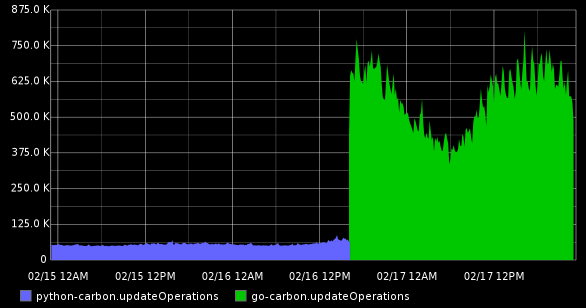

go-carbon [](https://travis-ci.org/lomik/go-carbon)
============

Golang implementation of Graphite/Carbon server with classic architecture: Agent -> Cache -> Persister


### Features
* Receive metrics from TCP and UDP ([plaintext protocol](http://graphite.readthedocs.org/en/latest/feeding-carbon.html#the-plaintext-protocol))
* Receive metrics with [Pickle protocol](http://graphite.readthedocs.org/en/latest/feeding-carbon.html#the-pickle-protocol) (TCP only)
* [storage-schemas.conf](http://graphite.readthedocs.org/en/latest/config-carbon.html#storage-schemas-conf)
* [storage-aggregation.conf](http://graphite.readthedocs.org/en/latest/config-carbon.html#storage-aggregation-conf)
* Carbonlink (requests to cache from graphite-web)
* Logging with rotation (reopen log by HUP signal or inotify event)
* Many persister workers (using many cpu cores)
* Run as daemon
* Grace stop on `USR2` signal: close all socket listeners, flush cache to disk and stop carbon
* Alternative grace stop on `USR2` signal (config `dump` section): start write new data to file, stop persister, dump cache to file, stop all (and restore from files after next start)
* Reload persister config (whisper section of main config, storage-schemas.conf and storage-aggregation.conf) on HUP signal

## Performance

Faster than default carbon. In all conditions :) How much faster depends on server hardware, storage-schemas, etc.

The result of replacing "carbon" to "go-carbon" on a server with a load up to 900 thousand metric per minute:



## Installation
Use binary packages from [releases page](https://github.com/lomik/go-carbon/releases) or build manually:
```
# build binary
git clone https://github.com/lomik/go-carbon.git
cd go-carbon
make submodules
make

# build rpm (centos 6)
make rpm

# build debian/ubuntu package
make deb

Install debian dependencies: 
apt-get install golang 

# hand-made install
sudo install -m 0755 go-carbon /usr/local/bin/go-carbon
sudo go-carbon --config-print-default > /usr/local/etc/carbon.conf
sudo vim /usr/local/etc/carbon.conf
sudo go-carbon --config /usr/local/etc/carbon.conf --daemon
```

## Configuration
```
$ go-carbon --help
Usage of go-carbon:
  -check-config=false: Check config and exit
  -config="": Filename of config
  -config-print-default=false: Print default config
  -daemon=false: Run in background
  -pidfile="": Pidfile path (only for daemon)
  -version=false: Print version
```

```
[common]
# Run as user. Works only in daemon mode
user = ""
# If logfile is empty use stderr
logfile = "/var/log/go-carbon/go-carbon.log"
# Logging error level. Valid values: "debug", "info", "warn", "warning", "error"
log-level = "info"
# Prefix for store all internal go-carbon graphs. Supported macroses: {host}
graph-prefix = "carbon.agents.{host}"
# Interval of storing internal metrics. Like CARBON_METRIC_INTERVAL
metric-interval = "1m0s"
# Endpoint for store internal carbon metrics. Valid values: "" or "local", "tcp://host:port", "udp://host:port"
metric-endpoint = ""
# Increase for configuration with multi persisters
max-cpu = 1

[whisper]
data-dir = "/data/graphite/whisper/"
# http://graphite.readthedocs.org/en/latest/config-carbon.html#storage-schemas-conf. Required
schemas-file = "/data/graphite/schemas"
# http://graphite.readthedocs.org/en/latest/config-carbon.html#storage-aggregation-conf. Optional
aggregation-file = ""
# Workers count. Metrics sharded by "crc32(metricName) % workers"
workers = 1
# Limits the number of whisper update_many() calls per second. 0 - no limit
max-updates-per-second = 0
# Sparse file creation
sparse-create = false
enabled = true

[cache]
# Limit of in-memory stored points (not metrics)
max-size = 1000000
# Strategy to persist metrics. Values: "max","sorted","noop"
#   "max" - write metrics with most unwritten datapoints first
#   "sorted" - sort by timestamp of first unwritten datapoint.
#   "noop" - pick metrics to write in unspecified order,
#            requires least CPU and improves cache responsiveness
write-strategy = "max"

[udp]
listen = ":2003"
enabled = true
# Enable optional logging of incomplete messages (chunked by MTU)
log-incomplete = false

[tcp]
listen = ":2003"
enabled = true

[pickle]
listen = ":2004"
enabled = true
# Limit message size for prevent memory overflow
max-message-size = 67108864

[carbonlink]
listen = "127.0.0.1:7002"
enabled = true
# Close inactive connections after "read-timeout"
read-timeout = "30s"
# Return empty result if cache not reply
query-timeout = "100ms"

[dump]
# Enable dump/restore function on USR2 signal
enabled = false
# Directory for store dump data. Should be writeable for carbon
path = ""
# Restore speed. 0 - unlimited
restore-per-second = 0

[pprof]
listen = "localhost:7007"
enabled = false
```

### OS tuning
It is crucial for performance to ensure that your OS tuned so that go-carbon
is never blocked on writes, usually that involves adjusting following sysctl
params on Linux systems:

```bash
# percentage of your RAM which can be left unwritten to disk. MUST be much more than
# your write rate, which is usually one FS block size (4KB) per metric.
sysctl -w vm.dirty_ratio = 80

# percentage of yout RAM when background writer have to kick in and
# start writes to disk. Make it way above the value you see in `/proc/meminfo|grep Dirty`
# so that it doesn't interefere with dirty_expire_centisecs explained below
sysctl -w vm.dirty_background_ratio = 50

# allow page to be left dirty no longer than 10 mins
# if unwritten page stays longer than time set here,
# kernel starts writing it out
sysctl -w vm.dirty_expire_centisecs = $(( 10*60*100 ))
```

Net effect of these 3 params is that with `dirty_*_ratio` params set high
enough multiple updates to a metric don't trigger disk activity. Multiple datapoint
writes are coalesced into single disk write which kernel then writes to disk
in a background.

With settings above applied, best write-strategy to use is "noop"

## Reported stats

| metric | description |
| --- | --- |
| cache.queueBuildCount | Number of times writeout queue was rebuilt (higher is better) |
| cache.queueBuildTimeMs | Total time spent rebuilding writeout queue. Divide by queueBuildCount to get average rebuild time (lower is better) |
| cache.queueWriteoutTimeMs | Time in milliseconds to make a full cycle writing all metrics. Divide by queueBuildCount to get average writeout time (lower is better) |


## Changelog
##### version 0.8.0
* Fully refactored and optimizer cache module (core of go-carbon) (thanks [Maxim Ivanov](https://github.com/redbaron))
* Added `noop` cache.write-strategy (thanks [Maxim Ivanov](https://github.com/redbaron))
* New optional dump/restore functional for minimize data loss on restart
* Refactored internal stat mechanics. `common.graph-prefix` and `common.metric-interval` now can be changed without restart (on HUP signal)
* Customizable internal metrics endpoint. `common.metric-endpoint` param. Valid values: "local" and "" (write directly to whisper), "tcp://host:port", "udp://host:port"

##### version 0.7.3
* Added `cache.write-strategy` option (values "max" or "sorted") (thanks [Alexander Akulov](https://github.com/AlexAkulov))
* `commitedPoints` metric renamed to `committedPoints`

##### version 0.7.2
* Added sparse file creation (`whisper.sparse-create` config option)
* Enable reload in init script (thanks [Jose Riguera](https://github.com/jriguera))
* Clean up schemas parser code (thanks [Dieter Plaetinck](https://github.com/Dieterbe))
* Better go-whisper error handling (thanks [Hiroaki Nakamura](https://github.com/hnakamur))
* Don't try to create whisper file if exists with bad permissions #21

##### version 0.7.1
* Fixed problem: Points in queue (channel) between cache and persister subsystems was invisible for carbonlink

##### version 0.7
* Grace stop on `USR2` signal: close all socket listeners, flush cache to disk and stop carbon
* Reload persister config (`whisper` section of main config, `storage-schemas.conf` and `storage-aggregation.conf`) on `HUP` signal 
* Fix bug: Cache may start save points only after first checkpoint
* Decimal numbers in log files instead of hexademical #22
* Fix bug: NaN values being saved in Whisper datafiles #17 (thanks [Andrew Hayworth](https://github.com/ahayworth))
* Fix bug: may crash on bad pickle message with big message size in header #30. Added option `pickle.max-message-size` with 64 MB default value
* Improved throttling (max-updates-per-second) performance #32

##### version 0.6
* `metric-interval` option 

##### version 0.5.5
* Cache module optimization

##### version 0.5.4
* Fix RPM init script

##### version 0.5.3
* Improved validation of bad wsp files
* RPM init script checks config before restart
* Debug logging of bad pickle messages

##### version 0.5.2
* Fix bug in go-whisper library: UpdateMany saves first point if many points has identical timestamp

##### version 0.5.1
* Reduced error level of "bad messages" in tcp and pickle receivers. Now `info`
* Configurable logging level. `log-level` option
* Fix `wrong carbonlink request` error in log

##### version 0.5.0
* `-check-config` validates schemas and aggregation configs
* Fix broken internal metrics `tcp.active` and `pickle.active`
* Optional udp incomplete messages logging: `log-incomplete` setting
* Fixes for working on x86-32
* logging fsnotify: fix ONCE rotation bug

##### version 0.4.3
* Optional whisper throttle setting #8: `max-updates-per-second`

##### version 0.4.2
* Fix bug in go-whisper: points in long archives missed if metrics retention count >=3

##### version 0.4.1
* Bug fix schemas parser

##### version 0.4
* Code refactoring and improved test coverage (thanks [Dave Rawks](https://github.com/drawks))
* Bug fixes

##### version 0.3
* Log "create wsp" as debug
* Log UDP checkpoint (calculate stats every minute)
* Rotate logfile by inotify event (without HUP)
* Check logfile opened
* [storage-aggregation.conf](http://graphite.readthedocs.org/en/latest/config-carbon.html#storage-aggregation-conf) support
* Create and chown logfile before daemonize and change user
* Debian package (thanks [Dave Rawks](https://github.com/drawks))

##### version 0.2
* Git submodule dependencies
* Init script for CentOS 6
* Makefile
* "make rpm" script
* Daemonize and run-as-user support
* `-check-config` option
* `-pidfile` option

##### version 0.1
+ First full-functional public version
+ Logging with HUP rotation support
+ UDP receiver
+ Tcp receiver
+ Pickle receiver
+ TOML-configs
+ Carbonlink
+ Multi-persister support
+ storage-schemas.conf support
